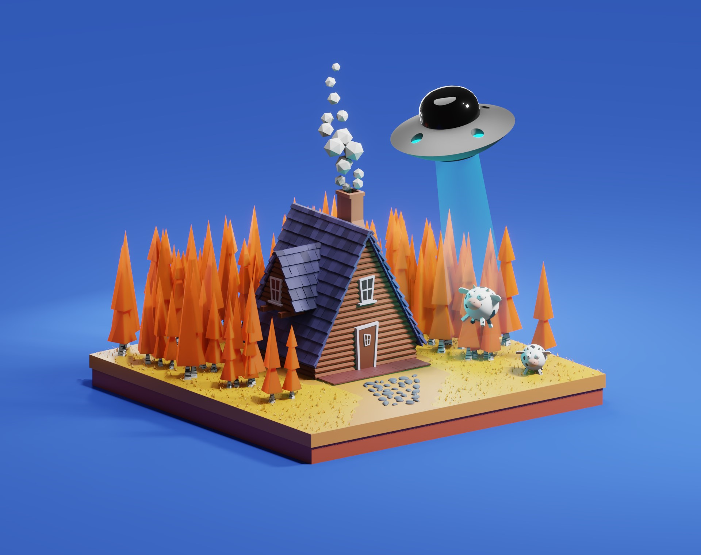
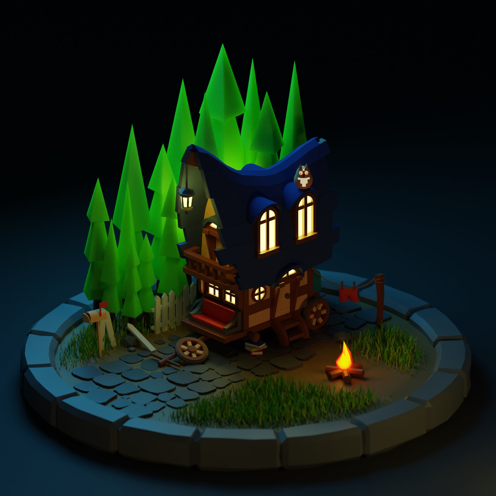

# **3D-Моделирование**

Меня зовут Ярослав и я увлекаюсь 3D-моделированием.3D моделирование – это отличная возможность воплотить мечты в реальность. Это может быть новый дом или интерьер, сказочный мир, новая галактика. Достаточно научиться создавать даже самые простенькие модели и анимировать их при необходимости. Это увлечение пришло ко мне несколько лет назад, когда я начал играть в компьютерные игры и проникся их визуальным оформлением. Вскоре я стал искать способы создать свои собственные дизайны и попробовать свои силы в 3D-моделировании.

В начале моего пути я занимался самообучением, изучая различные онлайн-курсы и обучающие материалы. Постепенно я начал улучшать свои навыки, создавая свои первые модели. Это были простые предметы, но я был доволен своими результатами.

Сейчас я продолжаю улучшать свои навыки и изучать новые программы и технологии. Я с нетерпением жду новых проектов и возможностей, чтобы продолжать применять свои знания в области 3D-моделирования.

